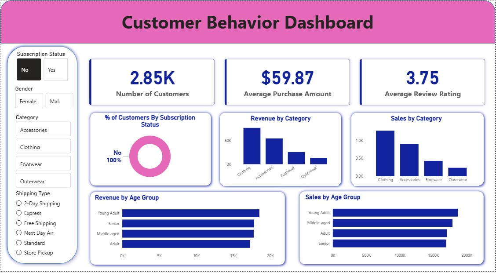

# Customer Shopping Behavior Analysis

## Project Overview

This project analyzes customer shopping behavior using Python, PostgreSQL, SQL, and Power BI.

The objective is to understand customer purchasing patterns, spending behavior, product performance, discount usage, customer segmentation, and revenue contribution across different customer groups.

The project follows an end-to-end data analytics workflow:

CSV Dataset → Python Data Cleaning → PostgreSQL → SQL Analysis → Power BI Dashboard

---

## Business Questions

The analysis answers the following business questions:

1. What is the total revenue generated by male vs. female customers?
2. Which customers used a discount but still spent more than the average purchase amount?
3. Which are the top 5 products with the highest average review rating?
4. How do average purchase amounts compare between Standard and Express Shipping?
5. Do subscribed customers spend more than non-subscribers?
6. Which products have the highest percentage of purchases with discounts?
7. How can customers be segmented into New, Returning, and Loyal customers?
8. What are the top 3 most purchased products within each category?
9. Are repeat buyers more likely to subscribe?
10. What is the revenue contribution of each age group?

---

## Dataset

The dataset contains 3,900 customer purchase records and 18 original columns.

### Main attributes

- Customer ID
- Age
- Gender
- Item Purchased
- Category
- Purchase Amount
- Location
- Size
- Color
- Season
- Review Rating
- Subscription Status
- Shipping Type
- Discount Applied
- Promo Code Used
- Previous Purchases
- Payment Method
- Frequency of Purchases

---

## Data Cleaning and Transformation

Python was used for data exploration, cleaning, and transformation.

### Data quality checks

- Inspected dataset structure using `df.info()`
- Generated descriptive statistics
- Checked missing values
- Identified 37 missing values in the Review Rating column

### Missing value treatment

Missing review ratings were imputed using the median review rating within each product category.

### Column standardization

Column names were converted to lowercase snake_case format for improved readability and SQL compatibility.

### Feature engineering

Two new columns were created:

- `age_group`
- `purchase_frequency_days`

Customers were grouped into four age groups:

- Young Adult
- Adult
- Middle-aged
- Senior

Purchase frequency categories were converted into an approximate number of days.

### Redundant column removal

`promo_code_used` was removed because it contained the same information as `discount_applied` in this dataset.

---

## SQL Analysis

The cleaned dataset was loaded into PostgreSQL.

SQL was used to perform:

- Revenue analysis
- Customer spending analysis
- Product rating analysis
- Shipping comparison
- Subscription analysis
- Discount analysis
- Customer segmentation
- Product ranking
- Repeat customer analysis
- Age-group revenue analysis

The SQL queries are available in:

`sql/customer_behavior_analysis.sql`

---

## Power BI Dashboard

Power BI was used to create an interactive dashboard for visualizing customer shopping behavior.



The dashboard focuses on:

- Total revenue
- Customer purchasing behavior
- Product performance
- Customer segmentation
- Subscription behavior
- Discount usage
- Age-group performance
- Category analysis

---

## Key Insights

Key business insights identified through the analysis include:

- Comparison of revenue generated by male and female customers
- Spending behavior of customers using discounts
- Best-performing products based on purchase volume and ratings
- Differences in spending across shipping methods
- Comparison between subscribers and non-subscribers
- Discount penetration across products
- Distribution of New, Returning, and Loyal customers
- Revenue contribution across age groups
- Relationship between repeat purchases and subscriptions

---

## Tools & Technologies

- Python
- Pandas
- PostgreSQL
- SQL
- SQLAlchemy
- Psycopg2
- Power BI
- Git & GitHub

---

## Project Structure

```text
customer-shopping-behavior-analysis/
│
├── data/
│   └── customer_shopping_behavior.csv
│
├── python/
│   └── customer_behavior_analysis.py
│
├── sql/
│   └── customer_behavior_analysis.sql
│
├── powerbi/
│   └── customer_behavior_dashboard.pbix
│
├── images/
│   └── customer_behavior_dashboard.png
│
├── README.md
│
└── .gitignore
